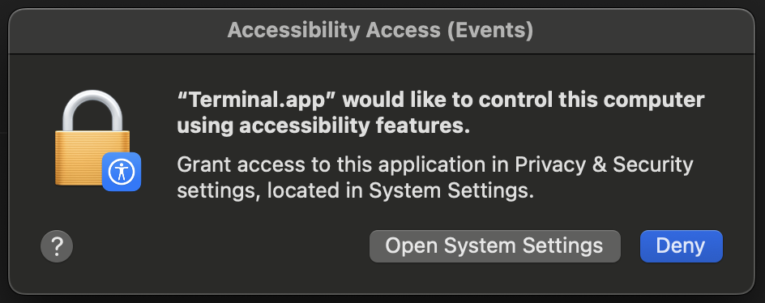
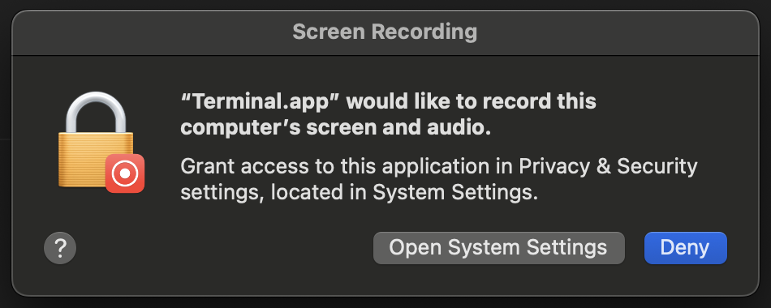
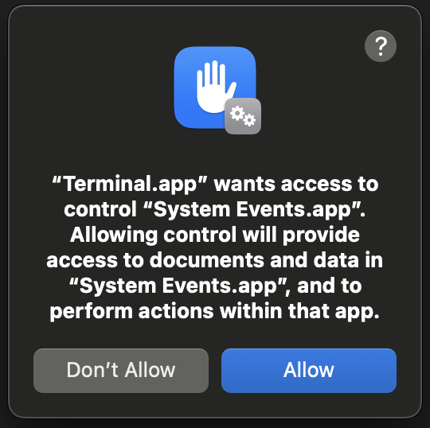

# Ad Watcher Bot

This bot automates watching video ads and withdrawals from a website, and sends a screenshot proof to a WhatsApp group.

To start, read [Getting started](#getting-started) section.

To use, read [Basic Usage](#basic-usage) section.

## Features

- Handles video ad watching with progress monitoring
- Browser automation or API-based task completion
- Automatic balance checking and withdrawal processing
- Sends task completion screenshot to WhatsApp group
- Works on macOS, not test yet on Windows and Linux

## Getting Started

### 1. Clone the repository

```bash
git clone https://github.com/ubergonmx/ad-watcher-bot.git
cd ad-watcher-bot
```

### 2. Run the interactive setup

The setup script will guide you through the entire configuration process:

```bash
python setup.py
```

The setup will:
- Check system requirements (Python, Chrome, ChromeDriver)
- Install all required dependencies
- Interactively configure your credentials ([step 3](#3-configuration-details))
- Validate your settings
- Check for optional enhancements

### 3. Configuration Details

The setup script will ask for the following information:

**Required Settings:**
- Website username (phone number)
- Website password
- Fund password (for withdrawals)
- Withdrawal amount (only 60, 250, 750...)
- Website URL (full URL with `https://` and no `/#` at the end)
- WhatsApp working group name

**Optional Settings:**
- Default identity (Internship, VIP1-VIP9) - Default: Internship
- Default method (browser/api) - Default: browser

Your configuration will be saved to `.env` file automatically.

### 4. macOS Users - Permission Setup

For macOS users, run the permission checker before using the bot:

```bash
python check_macos_permissions.py
```

This utility will guide you through granting the necessary permissions:

#### Required Permissions

The following permissions must be granted in macOS System Preferences:

- **Accessibility Access** - Required for mouse/keyboard automation


- **Screen Recording Access** - Required for screenshot capture and WhatsApp detection


- **Automation Access** - Reduces permission dialogs


Grant these permissions in: **System Preferences → Security & Privacy → Privacy**

## Usage

### Basic Usage

You have to run either of the commands below:

```bash
# Standard browser automation
python main.py

# API-based task completion (faster)
python main.py --api

# Complete all steps even if no tasks available
python main.py -c

# API mode with complete workflow
python main.py --api -c

# Skip WhatsApp message sending (complete workflow without messaging)
python main.py -c -sw

# API-only mode without browser (fastest, no WhatsApp or browser)
python main.py --api -sw
```

### Operation Modes

**Browser Mode** (Default):
- Uses Selenium WebDriver for browser automation
- Visual task completion with video monitoring
- More reliable but slower

**API Mode**:
- Direct API calls for task completion
- Faster execution
- Less resource intensive

### Command Line Options

**`-c, --complete`**: Complete all steps even if no tasks were completed
- Forces execution of withdrawal check, screenshot, and WhatsApp steps
- Useful for testing or when you want to send a status update regardless

**`-sw, --skip-whatsapp`**: Skip WhatsApp message sending
- Completes tasks and screenshots but doesn't send to WhatsApp
- When combined with `--api`, also skips opening the browser entirely
- Perfect for automated runs where messaging isn't needed

**`--api`**: Use API method for task completion
- Bypasses browser automation for faster execution
- More reliable for task completion
- When combined with `-sw`, creates a minimal, fast-running mode

### Features in Detail

**Smart Task Management:**
- Automatically detects available tasks
- Monitors video completion progress
- Handles different task types and states
- Prevents infinite loops with stall detection

**Balance & Withdrawal:**
- Checks account balance automatically
- Performs withdrawals when balance ≥ specified withdrawal amount
- Respects weekend restrictions (no withdrawals Sat-Sun)
- Validates withdrawal completion

**WhatsApp Integration (Works well on macOS):**
- Automatic WhatsApp opening and navigation
- Screenshot capture and verification
- Respects admin-only message restrictions
- Time-based sending restrictions (9:30 AM - 8:00 PM)

**Error Handling:**
- Automatic retry mechanisms
- Screenshot debugging on failures
- Progress tracking and recovery
- Graceful handling of permission issues

## Troubleshooting

### Common Issues

**Setup Problems:**
- Run `python setup.py` again if interrupted
- Check Python version (3.8+ required)
- Ensure Chrome browser is installed

**Permission Issues (macOS):**
- Run `python check_macos_permissions.py`
- Grant permissions in System Preferences
- Restart the terminal after granting permissions

**Login Failures:**
- Verify credentials in `.env` file
- Check if website URL is correct
- Ensure account is not locked

**WhatsApp Issues:**
- Install WhatsApp Desktop for better reliability
- Check if working group name is correct
- Verify WhatsApp is properly logged in

### Debug Files

The bot creates debug files for troubleshooting:
- `ad_watcher_bot.log` - Detailed execution logs
- `tasks_screenshot.png` - Task completion proof
- `debug_*.png` - Various debug screenshots
- `login_error.png` - Login failure diagnostics

## File Structure

```
ad-watcher-bot/
├── main.py                     # Main bot script
├── setup.py                    # Interactive setup script
├── check_macos_permissions.py  # macOS permission checker
├── requirements.txt            # Python dependencies
├── env.example                 # Environment template
├── .env                        # Your configuration (created by setup)
├── README.md                   # This file
└── ad_watcher_bot.log          # Created when main.py is running
```

## Requirements

- Python 3.8 or higher
- Google Chrome browser
- ChromeDriver (auto-installed via webdriver-manager)
- WhatsApp Desktop (recommended) or WhatsApp Web access
- Active internet connection

## Security Notes

- Your credentials are stored locally in `.env` file
- Never share the `.env` file to anyone
- Review permissions granted to the bot

## Disclaimer

This bot is for educational and automation purposes only. Users are responsible for:
- Complying with website terms of service
- Ensuring account security
- Using the bot responsibly

The developers are not responsible for any misuse, account restrictions, or other consequences arising from the use of this bot.